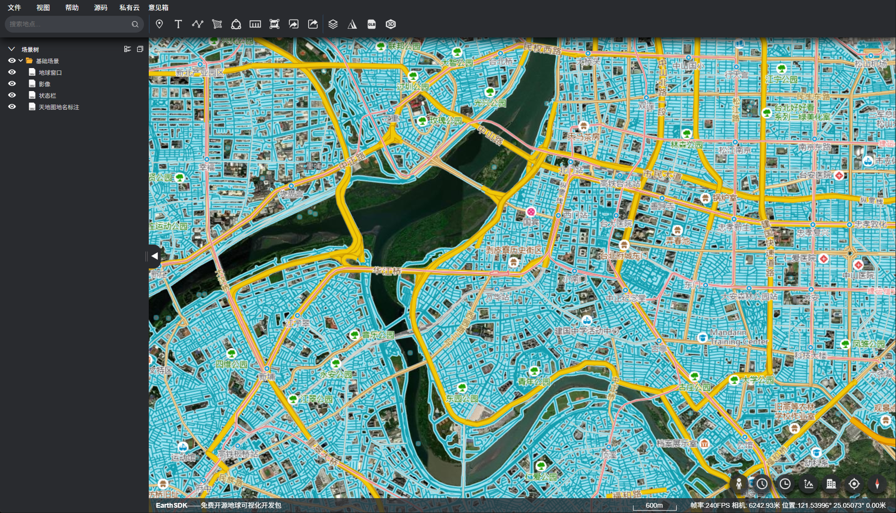

# 使用 Vue 和 EarthSDK 实现谷歌地球网页版
## 🎯 项目简介
本项目旨在基于 Vue 和 EarthSDK 实现一个类似谷歌地球网页版的三维地球应用，支持以下功能：

🌍 三维地球浏览

📷 街景视图

🕰 历史影像（包括 ArcGIS 提供的历史数据）

📐 测量工具（距离、面积、高度差）

📍 标记与注记

🔄 图层切换与管理

🧩 插件式架构，方便扩展新功能

## 🧱 技术栈
技术	说明
Vue 3	前端框架，采用 Composition API
EarthSDK	三维地球引擎
Vite	构建工具
ArcGIS Online / Wayback Imagery	历史影像数据源
Pinia	状态管理
Element Plus	UI 组件库
Axios	数据请求工具

``
yarn 
yarn serve
``

## 界面

## 街景

## 街景

## 谷歌地球历史影像

## arcgis历史影像

## 谷歌3dtiles
